# VoltFlow CRM - Complete Business Flow Diagram

## Overview
This document contains comprehensive Mermaid diagrams showing the complete business process flow of the VoltFlow CRM system, including all modules, status transitions, and cross-module conversions.

## Main Business Process Flow

```mermaid
graph TD
    %% Lead Management Flow
    subgraph LEADS["🎯 LEADS MODULE"]
        L1[New Lead] --> L2[Contacted]
        L2 --> L3[Qualified]
        L3 --> L4[Proposal Sent]
        L4 --> L5[Negotiation]
        L5 --> L6[Closed-Won]
        L5 --> L7[Closed-Lost]
        
        %% Lead Actions
        L1 -.-> LA1[Contact Lead]
        L2 -.-> LA2[Qualify Lead]
        L3 -.-> LA3[Send Proposal]
        L6 -.-> CONVERT1[Convert to Client]
    end

    %% Client Management Flow
    subgraph CLIENTS["👥 CLIENTS MODULE"]
        C1[Prospective] --> C2[Active]
        C2 --> C3[VIP]
        C2 --> C4[Inactive]
        
        %% Client Actions
        C1 -.-> CA1[Create Quote]
        C1 -.-> CA2[Schedule Consultation]
        C2 -.-> CA3[New Quote]
        C3 -.-> CA4[Priority Service]
    end

    %% Quote Management Flow
    subgraph QUOTES["📋 QUOTES MODULE"]
        Q1[Draft] --> Q2[Sent]
        Q2 --> Q3[Reviewed]
        Q3 --> Q4[Approved]
        Q3 --> Q5[Rejected]
        Q2 --> Q6[Expired]
        
        %% Quote Actions
        Q1 -.-> QA1[Send Quote]
        Q2 -.-> QA2[Follow Up]
        Q4 -.-> CONVERT2[Create Job]
    end

    %% Job Management Flow
    subgraph JOBS["🔧 JOBS MODULE"]
        J1[Scheduled] --> J2[Dispatched]
        J2 --> J3[In Progress]
        J3 --> J4[Completed]
        J4 --> J5[Needs Invoicing]
        
        %% Job Actions
        J1 -.-> JA1[Dispatch]
        J2 -.-> JA2[Start Work]
        J3 -.-> JA3[Mark Complete]
        J5 -.-> CONVERT3[Create Invoice]
    end

    %% Invoice Management Flow
    subgraph INVOICES["💰 INVOICES MODULE"]
        I1[Draft] --> I2[Sent]
        I2 --> I3[Viewed]
        I3 --> I4[Paid]
        I3 --> I5[Overdue]
        
        %% Invoice Actions
        I1 -.-> IA1[Send Invoice]
        I2 -.-> IA2[Follow Up]
        I5 -.-> IA3[Send Reminder]
    end

    %% Cross-Module Conversions
    CONVERT1 ==> C1
    CONVERT2 ==> J1
    CONVERT3 ==> I1

    %% Styling
    classDef leadStyle fill:#e1f5fe,stroke:#01579b,stroke-width:2px
    classDef clientStyle fill:#f3e5f5,stroke:#4a148c,stroke-width:2px
    classDef quoteStyle fill:#e8f5e8,stroke:#1b5e20,stroke-width:2px
    classDef jobStyle fill:#fff3e0,stroke:#e65100,stroke-width:2px
    classDef invoiceStyle fill:#f1f8e9,stroke:#33691e,stroke-width:2px
    classDef conversionStyle fill:#ffeb3b,stroke:#f57f17,stroke-width:3px

    class L1,L2,L3,L4,L5,L6,L7 leadStyle
    class C1,C2,C3,C4 clientStyle
    class Q1,Q2,Q3,Q4,Q5,Q6 quoteStyle
    class J1,J2,J3,J4,J5 jobStyle
    class I1,I2,I3,I4,I5 invoiceStyle
    class CONVERT1,CONVERT2,CONVERT3 conversionStyle
```



## Detailed Status Flow Diagram

```mermaid
flowchart LR
    subgraph "Lead Journey"
        direction TB
        LS1[🆕 New] --> LS2[📞 Contacted]
        LS2 --> LS3[✅ Qualified]
        LS3 --> LS4[📄 Proposal Sent]
        LS4 --> LS5[🤝 Negotiation]
        LS5 --> LS6[🎉 Closed-Won]
        LS5 --> LS7[❌ Closed-Lost]
    end

    subgraph "Client Lifecycle"
        direction TB
        CS1[🎯 Prospective] --> CS2[⚡ Active]
        CS2 --> CS3[⭐ VIP]
        CS2 --> CS4[😴 Inactive]
    end

    subgraph "Quote Process"
        direction TB
        QS1[📝 Draft] --> QS2[📤 Sent]
        QS2 --> QS3[👀 Reviewed]
        QS3 --> QS4[✅ Approved]
        QS3 --> QS5[❌ Rejected]
        QS2 --> QS6[⏰ Expired]
    end

    subgraph "Job Execution"
        direction TB
        JS1[📅 Scheduled] --> JS2[🚚 Dispatched]
        JS2 --> JS3[🔧 In Progress]
        JS3 --> JS4[✅ Completed]
        JS4 --> JS5[💰 Needs Invoicing]
    end

    subgraph "Invoice & Payment"
        direction TB
        IS1[📝 Draft] --> IS2[📤 Sent]
        IS2 --> IS3[👀 Viewed]
        IS3 --> IS4[💰 Paid]
        IS3 --> IS5[⚠️ Overdue]
    end

    %% Cross-module flows
    LS6 -.->|Convert| CS1
    QS4 -.->|Create Job| JS1
    JS5 -.->|Generate Invoice| IS1

    %% Styling
    classDef newStatus fill:#e3f2fd,stroke:#1976d2,stroke-width:2px
    classDef activeStatus fill:#e8f5e8,stroke:#388e3c,stroke-width:2px
    classDef completedStatus fill:#f3e5f5,stroke:#7b1fa2,stroke-width:2px
    classDef warningStatus fill:#fff3e0,stroke:#f57c00,stroke-width:2px
    classDef errorStatus fill:#ffebee,stroke:#d32f2f,stroke-width:2px
```



## Conversion Workflow Diagram


## Business Intelligence Flow

```mermaid
graph TB
    subgraph "Data Sources"
        DS1[Leads Data]
        DS2[Clients Data]
        DS3[Quotes Data]
        DS4[Jobs Data]
        DS5[Invoices Data]
    end

    subgraph "Analytics Engine"
        AE1[Lead Conversion Rate]
        AE2[Client Lifetime Value]
        AE3[Quote Approval Rate]
        AE4[Job Completion Time]
        AE5[Payment Collection Rate]
    end

    subgraph "Insights Panels"
        IP1[Lead Flow Insights]
        IP2[Client Flow Insights]
        IP3[Quote Flow Insights]
        IP4[Job Flow Insights]
        IP5[Invoice Flow Insights]
    end

    DS1 --> AE1 --> IP1
    DS2 --> AE2 --> IP2
    DS3 --> AE3 --> IP3
    DS4 --> AE4 --> IP4
    DS5 --> AE5 --> IP5

    IP1 -.-> Dashboard[📊 Executive Dashboard]
    IP2 -.-> Dashboard
    IP3 -.-> Dashboard
    IP4 -.-> Dashboard
    IP5 -.-> Dashboard
```



## Technical Architecture Flow

```mermaid
graph TD
    subgraph "Frontend Components"
        FC1[StatusBadge.tsx]
        FC2[FlowActions.tsx]
        FC3[ConversionModal.tsx]
        FC4[SkeletonLoader.tsx]
    end

    subgraph "Flow Logic"
        FL1[flowStates.ts]
        FL2[Lead Status System]
        FL3[Client Status System]
        FL4[Quote Status System]
        FL5[Job Status System]
        FL6[Invoice Status System]
    end

    subgraph "Data Layer"
        DL1[Supabase Client]
        DL2[Mock Data]
        DL3[Type Definitions]
    end

    subgraph "Pages"
        P1[/leads]
        P2[/clients]
        P3[/quotes]
        P4[/jobs]
        P5[/invoices]
    end

    FC1 --> FL1
    FC2 --> FL1
    FC3 --> FL1
    
    FL1 --> FL2
    FL1 --> FL3
    FL1 --> FL4
    FL1 --> FL5
    FL1 --> FL6

    P1 --> FC1 & FC2 & FC3
    P2 --> FC1 & FC2 & FC3
    P3 --> FC1 & FC2 & FC3
    P4 --> FC1 & FC2 & FC3
    P5 --> FC1 & FC2 & FC3

    DL1 --> P1 & P2 & P3 & P4 & P5
    DL2 --> P1 & P2 & P3 & P4 & P5
    DL3 --> P1 & P2 & P3 & P4 & P5
```

## Implementation Status


## Key Features Summary

### ✅ **Complete Business Flow**
- Lead capture → Client conversion → Quote generation → Job execution → Invoice collection
- Automated status transitions with business logic validation
- Cross-module data relationships and tracking

### ✅ **Working Conversions**
- Modal-based conversion workflows with data pre-population
- Lead to Client conversion with client type selection
- Quote to Job conversion with scheduling and assignment
- Job to Invoice conversion with billing and payment terms

### ✅ **Business Intelligence**
- Real-time insights panels on every module page
- Pipeline value tracking and performance metrics
- Status distribution analytics and trend monitoring
- Executive dashboard with consolidated KPIs

### ✅ **Professional UI/UX**
- Modern, responsive design with mobile-first approach
- Consistent status badge system across all modules
- Smart action recommendations based on current status
- Smooth animations and micro-interactions

---

**Generated**: June 1, 2024  
**Status**: 100% Implementation Complete  
**Server**: http://localhost:3000 